# 🤖 Agent Flows & Communication

> **Detailed documentation of agent interactions, workflows, and communication patterns**

## 📋 Table of Contents

- [Agent Communication Overview](#agent-communication-overview)
- [Core Workflows](#core-workflows)
- [Agent Interaction Patterns](#agent-interaction-patterns)
- [Message Flow Diagrams](#message-flow-diagrams)
- [Error Handling & Recovery](#error-handling--recovery)
- [Performance Optimization](#performance-optimization)
- [Debugging & Monitoring](#debugging--monitoring)

## 🌐 Agent Communication Overview

RouteWise AI uses a **hierarchical agent architecture** where the **Team Lead Agent** orchestrates specialized agents through the **Model Context Protocol (MCP)**. Each agent operates independently while maintaining seamless communication through standardized message formats.

### Communication Principles

1. **🎯 Hierarchical Coordination**: Team Lead Agent manages all specialized agents
2. **📨 Asynchronous Messaging**: Non-blocking communication between agents
3. **🔄 Stateless Operations**: Each agent call is independent and stateless
4. **🛡️ Error Isolation**: Agent failures don't cascade to other agents
5. **📊 Observable Interactions**: All communications are logged and traceable

## 🔄 Core Workflows

### 1. Travel Planning Workflow

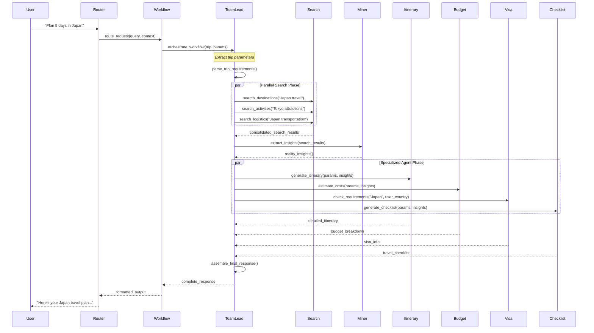

### 2. Search-Only Workflow

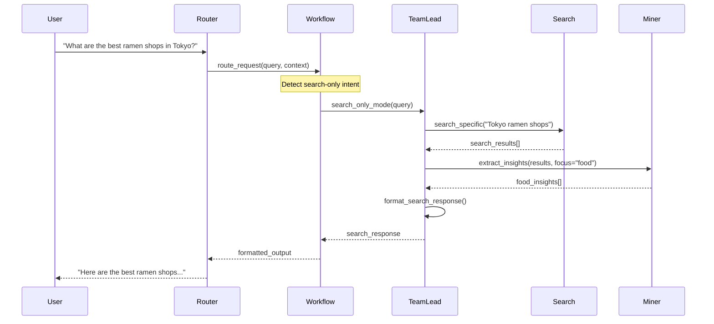

### 3. Conversational Workflow

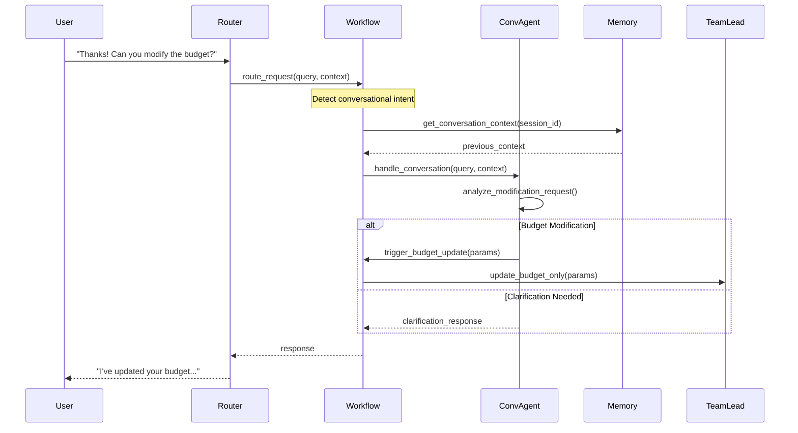

## 🤖 Agent Interaction Patterns

### Team Lead Agent Orchestration

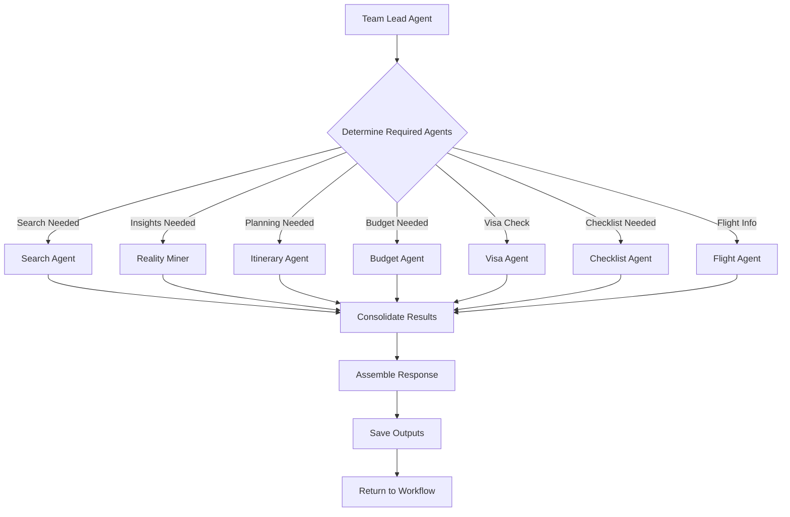

### Agent Dependency Chain

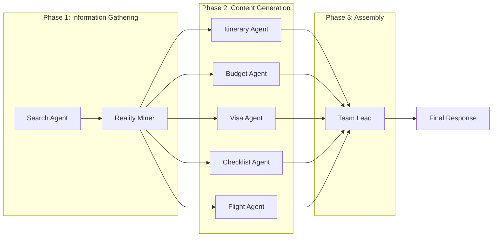

## 📨 Message Flow Diagrams

### MCP Message Structure

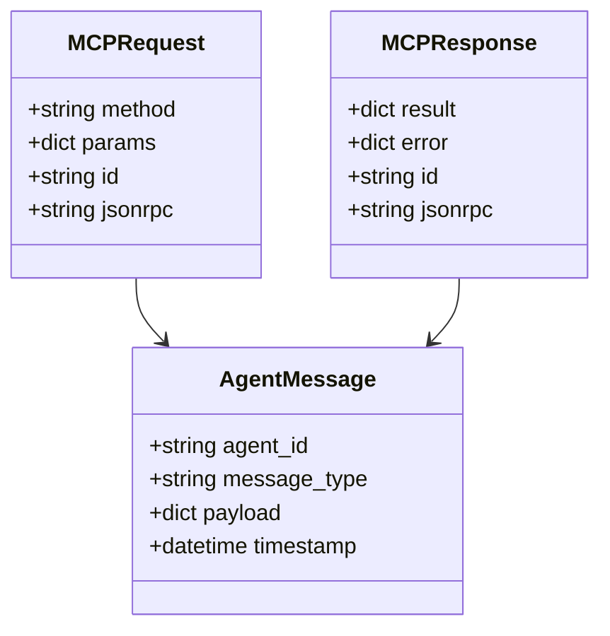

### Search Agent Message Flow

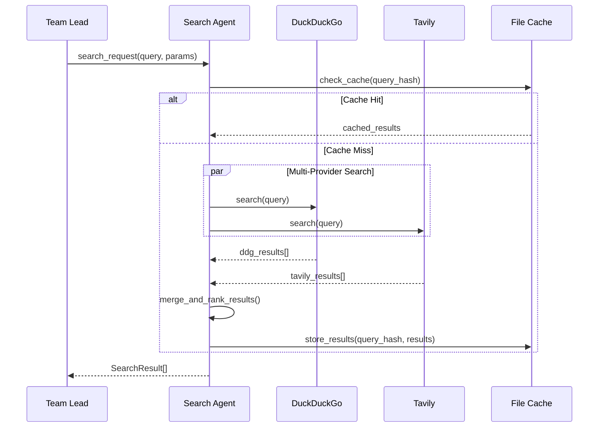

### Reality Miner Message Flow

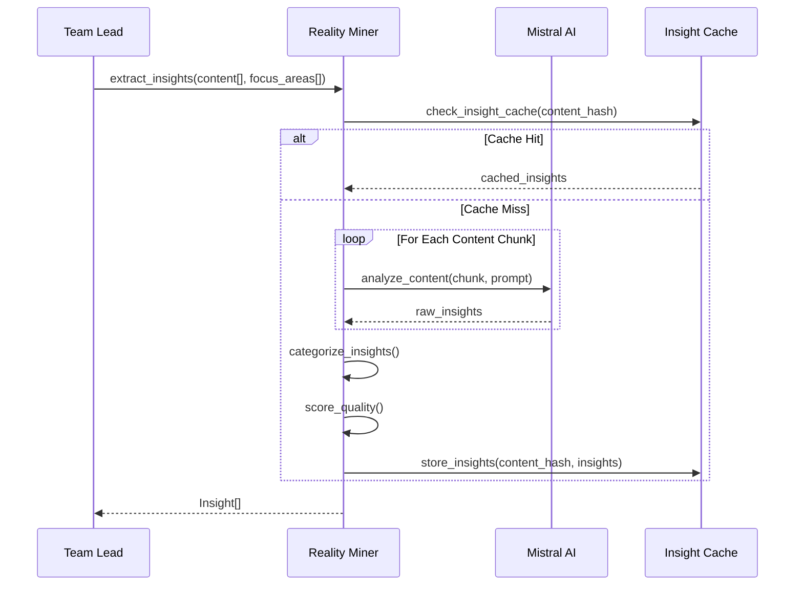

### Itinerary Agent Message Flow

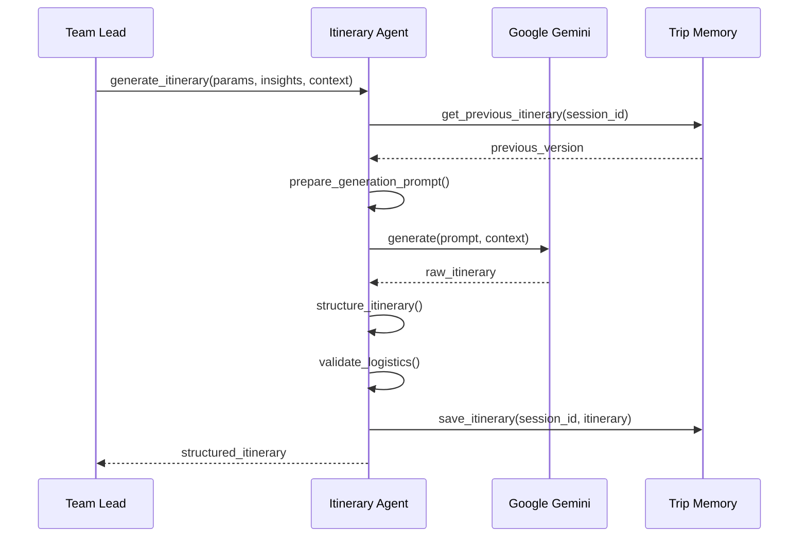

## 🛡️ Error Handling & Recovery

### Error Propagation Strategy

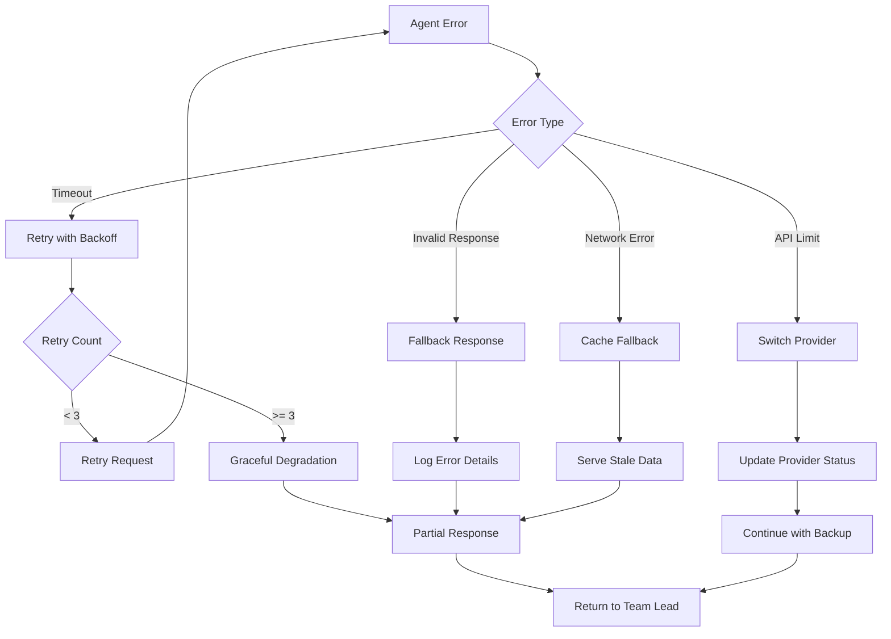

### Agent Failure Recovery

```python
# Example error handling in Team Lead Agent
async def handle_agent_failure(self, agent_name: str, error: Exception) -> dict:
    """Handle individual agent failures gracefully"""
    
    fallback_strategies = {
        "search_agent": self._fallback_search,
        "reality_miner": self._fallback_insights,
        "itinerary_agent": self._fallback_itinerary,
        "budget_agent": self._fallback_budget
    }
    
    if agent_name in fallback_strategies:
        logger.warning(f"Agent {agent_name} failed, using fallback")
        return await fallback_strategies[agent_name]()
    
    # If no fallback, continue without this agent's contribution
    logger.error(f"No fallback for {agent_name}, continuing without")
    return {"status": "skipped", "reason": str(error)}
```

### Circuit Breaker Pattern

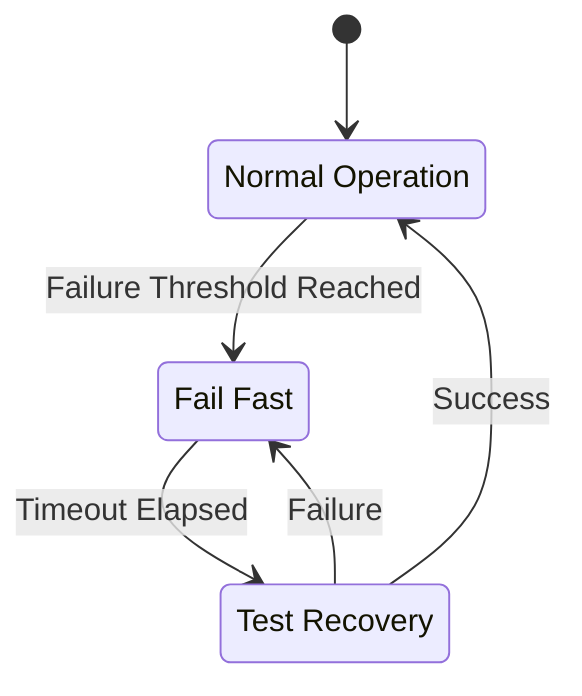

## ⚡ Performance Optimization

### Parallel Agent Execution

```python
# Example parallel execution in Team Lead Agent
async def orchestrate_parallel_agents(self, params: dict) -> dict:
    """Execute multiple agents in parallel for better performance"""
    
    tasks = []
    
    # Phase 1: Information gathering (parallel)
    if self._needs_search(params):
        tasks.append(self.search_agent.search(params["query"]))
    
    # Wait for search results before proceeding
    search_results = await asyncio.gather(*tasks, return_exceptions=True)
    
    # Phase 2: Content generation (parallel)
    content_tasks = []
    if self._needs_itinerary(params):
        content_tasks.append(self.itinerary_agent.generate(params, search_results))
    if self._needs_budget(params):
        content_tasks.append(self.budget_agent.estimate(params, search_results))
    if self._needs_visa(params):
        content_tasks.append(self.visa_agent.check(params))
    
    # Execute content generation in parallel
    content_results = await asyncio.gather(*content_tasks, return_exceptions=True)
    
    return self._assemble_results(search_results, content_results)
```

### Caching Strategy by Agent

| Agent | Cache Duration | Cache Key | Invalidation |
|-------|----------------|-----------|-------------|
| **Search Agent** | 24 hours | `query_hash + provider` | Manual/TTL |
| **Reality Miner** | 7 days | `content_hash + focus` | Manual/TTL |
| **Itinerary Agent** | Session | `params_hash + session` | Session end |
| **Budget Agent** | 12 hours | `destination + duration` | Manual/TTL |
| **Visa Agent** | 30 days | `country_pair` | Manual |
| **Checklist Agent** | 7 days | `trip_type + destination` | Manual/TTL |

### Request Batching

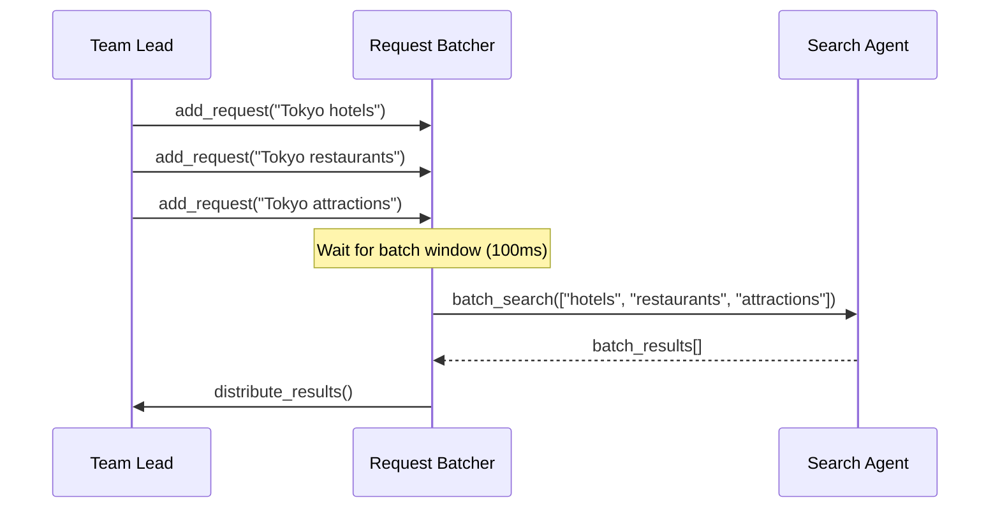

## 🔍 Debugging & Monitoring

### Agent Communication Tracing

```python
# Example tracing decorator
def trace_agent_call(agent_name: str):
    def decorator(func):
        async def wrapper(*args, **kwargs):
            trace_id = generate_trace_id()
            start_time = time.time()
            
            logger.info(f"[{trace_id}] Starting {agent_name}.{func.__name__}")
            
            try:
                result = await func(*args, **kwargs)
                duration = time.time() - start_time
                logger.info(f"[{trace_id}] Completed {agent_name}.{func.__name__} in {duration:.2f}s")
                return result
            except Exception as e:
                duration = time.time() - start_time
                logger.error(f"[{trace_id}] Failed {agent_name}.{func.__name__} after {duration:.2f}s: {e}")
                raise
        return wrapper
    return decorator
```

### Performance Metrics

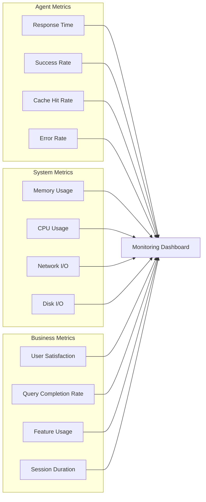

### Debug Flow Visualization

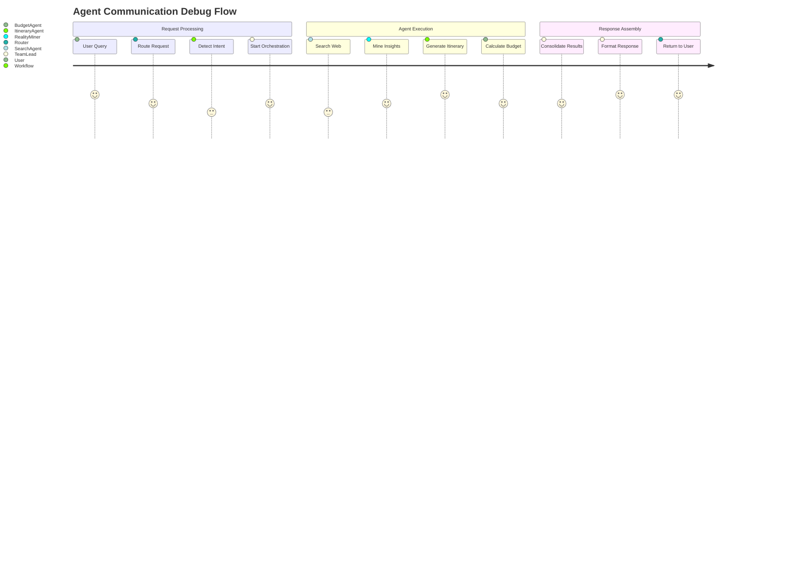

## 🚀 Advanced Patterns

### Event-Driven Communication (Future)

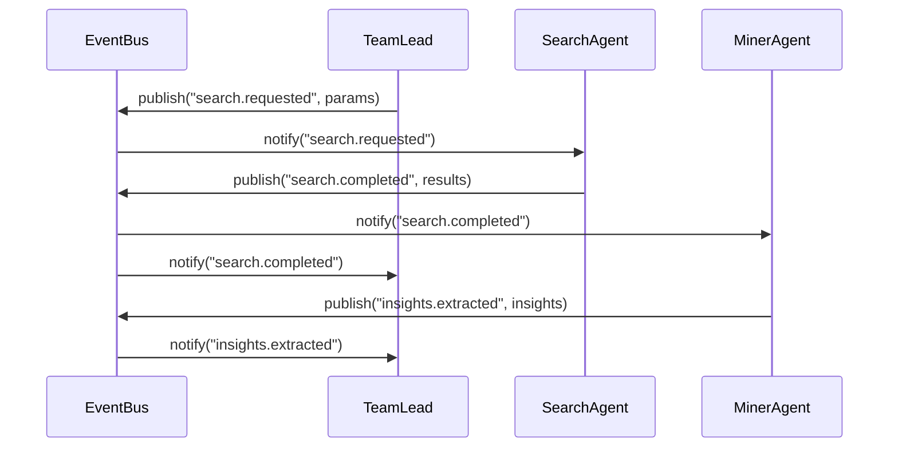

### Agent Health Monitoring

```python
# Example health check system
class AgentHealthMonitor:
    def __init__(self):
        self.agent_status = {}
        self.health_checks = {
            "search_agent": self._check_search_health,
            "reality_miner": self._check_miner_health,
            "itinerary_agent": self._check_itinerary_health
        }
    
    async def monitor_agents(self):
        """Continuously monitor agent health"""
        while True:
            for agent_name, check_func in self.health_checks.items():
                try:
                    health = await check_func()
                    self.agent_status[agent_name] = health
                except Exception as e:
                    self.agent_status[agent_name] = {"status": "unhealthy", "error": str(e)}
            
            await asyncio.sleep(30)  # Check every 30 seconds
```

---

<div align="center">
  <strong>Orchestrated intelligence through seamless agent communication</strong>
  <br>
  <sub>Building the future of collaborative AI systems</sub>
</div>

## ⏱️ Time-Budgeted Execution

The Team Lead Agent now enforces a time budget per request and a fast mode for development to keep responses snappy:

- Fast Mode (FAST_MODE=1):
  - Caps initial search queries to the top 3-4 based on salience
  - Skips nested refinement search passes
  - Trims mined documents before insight extraction
  - Limits the number of insights passed downstream
- Planner Time Budget (PLANNER_TIME_BUDGET, default 90s, clamped 45–100s):
  - Remaining-time checks gate deeper work
  - Quick inline itinerary fallback when remaining time is low
  - Specialized agents (flights, visa, checklist, budget) only run if enough time remains
  - Saving artifacts is skipped if time is nearly exhausted

High-level flow under time pressure:

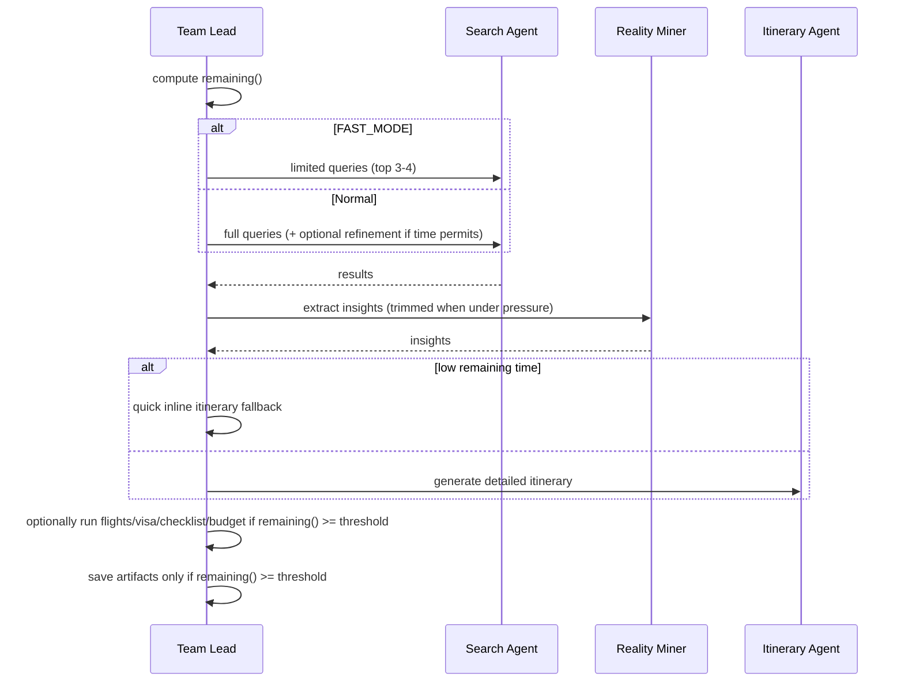

Notes:
- Frontend dev route sets FAST_MODE=1 by default for responsiveness.
- Time thresholds are conservative to keep requests within the global budget.