# 🏗️ RouteWise AI Architecture

> **Comprehensive guide to the system design, components, and data flow**

## 📋 Table of Contents

- [System Overview](#system-overview)
- [Core Components](#core-components)
- [Agent Architecture](#agent-architecture)
- [Data Flow](#data-flow)
- [MCP Protocol Integration](#mcp-protocol-integration)
- [Memory Management](#memory-management)
- [Search & Reality Mining](#search--reality-mining)
- [Performance Considerations](#performance-considerations)

## 🌐 System Overview

RouteWise AI is built on a **multi-agent architecture** using the **Model Context Protocol (MCP)** for seamless communication between specialized agents. The system prioritizes **reality-first intelligence** by mining real user experiences and practical insights from travel communities.

### Key Architectural Principles

1. **🔄 Agent Orchestration**: Specialized agents handle specific domains (search, reality mining, itinerary planning)
2. **🧠 Context Awareness**: Persistent memory and conversation history across sessions
3. **⚡ Intelligent Routing**: Dynamic routing between chat, search, and planning modes
4. **🎯 Reality-First**: Prioritizes practical, first-hand travel experiences over generic content
5. **🔌 Extensible Design**: Modular architecture for easy addition of new agents and capabilities

## 🏛️ Core Components

```mermaid
graph TB
    subgraph "Client Layer"
        WebUI[🌐 Next.js Web UI]
        CLI[💻 CLI Client]
        TG[📱 Telegram Bot]
        API[🔌 REST API]
    end
    
    subgraph "Orchestration Layer"
        Router[🎯 MCP Router]
        Workflow[⚡ MCP Workflow]
        Memory[🧠 Memory Manager]
        ConvAgent[💬 Conversational Agent]
    end
    
    subgraph "Agent Layer"
        TeamLead[👨‍💼 Team Lead Agent]
        Search[🔍 Search Agent]
        Miner[⛏️ Reality Miner Agent]
        Itinerary[📋 Itinerary Agent]
        Budget[💰 Budget Agent]
        Flight[✈️ Flight Agent]
        Visa[📄 Visa Agent]
        Checklist[✅ Checklist Agent]
    end
    
    subgraph "External Services"
        Mistral[🧠 Mistral AI]
        Gemini[💎 Google Gemini]
        DDG[🦆 DuckDuckGo]
        Tavily[🔎 Tavily API]
    end
    
    subgraph "Storage Layer"
        SQLite[(🗄️ SQLite DB)]
        Cache[📦 File Cache]
        Files[📁 Output Files]
    end
    
    WebUI --> Router
    CLI --> Router
    TG --> Router
    API --> Router
    
    Router --> Workflow
    Workflow --> Memory
    Workflow --> ConvAgent
    Workflow --> TeamLead
    
    TeamLead --> Search
    TeamLead --> Miner
    TeamLead --> Itinerary
    TeamLead --> Budget
    TeamLead --> Flight
    TeamLead --> Visa
    TeamLead --> Checklist
    
    Search --> DDG
    Search --> Tavily
    Miner --> Mistral
    Itinerary --> Gemini
    Budget --> Mistral
    Flight --> Mistral
    Visa --> Mistral
    Checklist --> Mistral
    
    Memory --> SQLite
    Search --> Cache
    TeamLead --> Files
```



### Component Responsibilities

| Component | Purpose | Technology |
|-----------|---------|------------|
| **MCP Router** | Routes requests to appropriate workflow | Python |
| **MCP Workflow** | Orchestrates agent interactions | Python + MCP |
| **Memory Manager** | Handles conversation history and context | SQLite |
| **Team Lead Agent** | Coordinates specialized agents | Python + MCP |
| **Search Agent** | Web search and content extraction | DuckDuckGo + Tavily |
| **Reality Miner** | Extracts practical insights from content | Mistral AI |
| **Itinerary Agent** | Generates detailed travel plans | Google Gemini |
| **Budget Agent** | Estimates costs and budget breakdowns | Mistral AI |

## 🤖 Agent Architecture

### Agent Communication Pattern


### Agent Specialization

#### 🔍 Search Agent
- **Purpose**: Web search and content extraction
- **Capabilities**:
  - Multi-provider search (DuckDuckGo, Tavily)
  - Content extraction with Trafilatura
  - Reality-first result ranking
  - Intelligent caching

#### ⛏️ Reality Miner Agent
- **Purpose**: Extract practical insights from web content
- **Capabilities**:
  - Scam and warning detection
  - Cost and timing insights
  - Local tips and hacks
  - Safety recommendations

#### 📋 Itinerary Agent
- **Purpose**: Generate detailed travel plans
- **Capabilities**:
  - Day-by-day planning
  - Activity clustering
  - Time optimization
  - Preference adaptation

#### 💰 Budget Agent
- **Purpose**: Cost estimation and budget planning
- **Capabilities**:
  - Regional cost analysis
  - Budget breakdown by category
  - Cost-saving recommendations
  - Currency conversion

## 🔄 Data Flow

### Request Processing Flow


### Memory and Context Flow


## 🔌 MCP Protocol Integration

### MCP Server Architecture

Each agent runs as an independent MCP server, enabling:

- **🔄 Standardized Communication**: Consistent message format across agents
- **🔌 Hot-Swappable Agents**: Add/remove agents without system restart
- **📊 Resource Management**: Independent scaling and monitoring
- **🛡️ Error Isolation**: Agent failures don't cascade

```python
# Example MCP Server Structure
class SearchMCPServer:
    def __init__(self, settings: Settings):
        self.tools = SearchTools(settings)
        
    async def handle_request(self, request: MCPRequest) -> MCPResponse:
        if request.method == "search":
            results = self.tools.search(request.params["query"])
            return MCPResponse(content=results)
```

### Agent Registration


## 🧠 Memory Management

### Conversation Memory


### Context Retrieval Strategy

1. **Recent Context**: Last 5 messages for immediate context
2. **Trip Context**: Current trip parameters and preferences
3. **Refinement History**: Previous modifications and feedback
4. **Insight Cache**: Relevant reality insights for the destination

## 🔍 Search & Reality Mining

### Search Strategy


### Reality Mining Pipeline


## ⚡ Performance Considerations

### Caching Strategy

- **Search Results**: 24-hour cache for popular queries
- **Reality Insights**: 7-day cache for destination-specific insights
- **Generated Content**: Session-based cache for refinements

### Optimization Techniques

1. **Parallel Agent Execution**: Multiple agents run concurrently
2. **Intelligent Query Batching**: Combine related searches
3. **Content Deduplication**: Remove duplicate search results
4. **Lazy Loading**: Load additional content only when needed

### Scalability Metrics

| Metric | Target | Current |
|--------|--------|---------|
| Response Time | < 5s | ~3-8s |
| Concurrent Users | 100+ | 50+ |
| Cache Hit Rate | 80% | ~70% |
| Memory Usage | < 1GB | ~500MB |

## 🔧 Configuration Management

### Environment-Based Configuration

```python
@dataclass
class Settings:
    # API Keys
    mistral_api_key: str
    gemini_api_key: str
    tavily_api_key: Optional[str] = None
    
    # Search Configuration
    search_provider: Literal["duckduckgo", "tavily", "hybrid"] = "hybrid"
    max_results: int = 10
    
    # Performance
    request_timeout: int = 20
    cache_ttl: int = 86400  # 24 hours
    
    # Storage
    output_dir: str = "src/data/examples"
    cache_dir: str = "src/data/cache"
    db_path: str = "src/data/memory.db"
```

### Agent Configuration

Each agent can be configured independently:

```yaml
# config/agents.yaml
search_agent:
  providers: ["duckduckgo", "tavily"]
  max_results: 15
  content_extraction: true
  
reality_miner:
  model: "mistral-large"
  insight_types: ["scam", "warning", "hack", "cost"]
  confidence_threshold: 0.7
  
itinerary_agent:
  model: "gemini-pro"
  max_days: 30
  activity_clustering: true
```

## 🚀 Future Architecture Enhancements

### Planned Improvements

1. **🔄 Event-Driven Architecture**: Move to event-based communication
2. **📊 Real-Time Analytics**: Live performance monitoring
3. **🤖 ML-Based Routing**: Intelligent request routing based on patterns
4. **🌐 Distributed Agents**: Scale agents across multiple servers
5. **🔒 Enhanced Security**: OAuth integration and rate limiting

### Technology Roadmap


---

<div align="center">
  <strong>Architecture designed for scale, built for intelligence</strong>
  <br>
  <sub>Enabling the next generation of travel planning</sub>
</div>